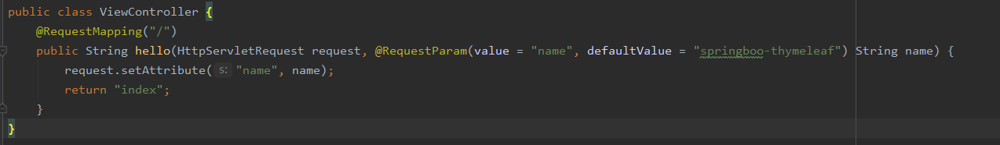
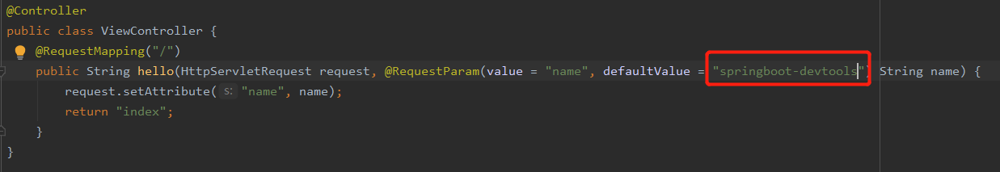
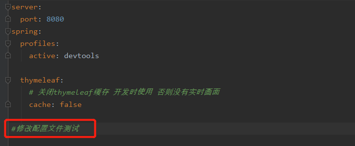

# 项目介绍
springboot集成devtools工具配合IDEA项目开发编辑器实现项目热部署。
# devtools工具介绍

# 依赖引入
```
    <dependency>
            <groupId>org.springframework.boot</groupId>
            <artifactId>spring-boot-devtools</artifactId>
    </dependency>

    <build>
        <plugins>
            <plugin>
                <groupId>org.springframework.boot</groupId>
                <artifactId>spring-boot-maven-plugin</artifactId>
                <!--必须要加入该配置，否则devtools不会起作用，即应用不会restart-->
                <configuration>
                    <fork>
                        true
                    </fork>
                </configuration>
            </plugin>
        </plugins>
    </build>
```
完整项目依赖请参见[pom.xml文件](pom.xml)

# 配置
核心配置
```
spring:
  devtools:
    restart:
      enabled: true
```
完整项目配置请参见[application.yml](application.yml)与[application-devtools.yml](application-devtools.yml)  

# IDEA配置
当修改了Java类后，IDEA默认是不自动编译的，而spring-boot-devtools又是监测classpath下的文件发生变化才会重启应用，所以需要设置IDEA的自动编译，进行两点配置。  
（1）路径 File -> Settings -> Compiler -> Build Project automatically 打钩  

（2）快捷键 ctrl + shift + alt + /,选择Registry,Compiler autoMake allow when app running打钩  

注意：配完后idea需要重启

# 测试说明
（1）修改类–>保存：应用会重启  
启动项目浏览器访问http://localhost:8080/，未做任何改动前，页面显示为  
修改ViewController类，代码改动，不用自己重启服务，大约几秒不动操作界面服务会自动重启（idea控制台日志会监控到），再次在浏览器访问http://localhost:8080/页面显示为

（2）修改配置文件–>保存：应用会重启
清掉控制台日志，修改application.yml配置文件，几秒钟后通过IDEA的控制台会看到服务重启。  

（3）修改页面–>保存：应用不会重启，但会重新加载，页面会刷新（原理是将spring.thymeleaf.cache设为false，参考:Spring Boot配置模板引擎）
清掉控制台日志，修改index.html文件将hello改为hello1，不用做任何操作，几秒钟后再次访问http://localhost:8080/，页面会随之刷新，原来的内容变为。

至此，devtools工具集成测试成功。