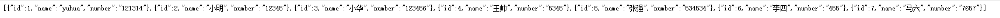

# 项目介绍
以druid为mysql数据库连接池，springboot整合mybaits-plus实现代码的CRUD

# druid说明

Apache Druid是一个实时分析型数据库，旨在对大型数据集进行快速的查询分析（"OLAP"查询)。Druid最常被当做数据库来用以支持实时摄取、高性能查询和高稳定运行的应用场景，同时，Druid也通常被用来助力分析型应用的图形化界面，或者当做需要快速聚合的高并发后端API，Druid最适合应用于面向事件类型的数据。
```
Druid通常应用于以下场景：  
点击流分析（Web端和移动端）  
网络监测分析（网络性能监控）  
服务指标存储  
供应链分析（制造类指标）  
应用性能指标分析  
数字广告分析  
商务智能 / OLAP
```

#依赖引入说明
```
        <!--druid数据库连接池starter 官方文档https://github.com/alibaba/druid/tree/master/druid-spring-boot-starter-->
        <dependency>
            <groupId>com.alibaba</groupId>
            <artifactId>druid-spring-boot-starter</artifactId>
            <version>${springboot.druid.version}</version>
        </dependency>

```
完整项目依赖请参见[pom.xml文件](pom.xml)
# 配置说明
druid配置
```
spring:
    datasource:
        type: com.alibaba.druid.pool.DruidDataSource
        driverClassName: com.mysql.cj.jdbc.Driver
        url: jdbc:mysql://localhost:3306/test?useUnicode=true&characterEncoding=utf-8&useSSL=false
        username: root
        password: 123456
```
完整项目配置请参见[application.yml](application.yml)与[application-druid.yml](application-druid.yml)  
其他配置根据需要可参见[druid官方文档](https://github.com/alibaba/druid/tree/master/druid-spring-boot-starter)
#测试说明
在浏览器访问地址http://localhost:8080/student/list,成功则返回

