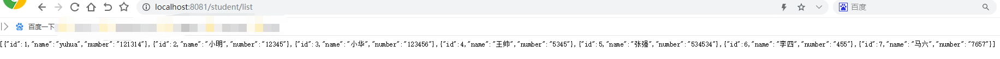

#项目说明
前提：mybatis-plus集成。
springboot-hiraki项目完成了springboot与hiraki数据库连接池和mybatis-plus持久化框架的整合。
# hikari说明
hikari是业内认为的性能最好，速度最快的数据库连接池
# 依赖引入说明
springboot2.0以上默认集成了hikari，所以无需再引入依赖。  
完整项目依赖请参见[pom.xml文件](pom.xml)
# hikari配置
核心配置
```
spring:
  datasource:
  type: com.zaxxer.hikari.HikariDataSource
  driverClassName: com.mysql.jdbc.Driver
  url: jdbc:mysql://localhost:3306/test?useUnicode=true&characterEncoding=utf-8&useSSL=false
  username: root
  password: root
  hikari:
    minimum-idle: 5
    idle-timeout: 180000
    maximum-pool-size: 10
    auto-commit: true
    pool-name: MyHikariCP
    connection-timeout: 30000
    connection-test-query: SELECT 1
```
完整项目配置请参见[application.yml](application.yml)与[application-hikari.yml](application-hikari.yml)  

#测试说明
springboot整合完Hiraki后，需要对整合结果进行验证，这儿采取web页面访问获取数据的方式，同时需要整合mybatis-plus框架

启动服务后，访问http://localhost:8080/student/list ，成功则返回成功则返回。