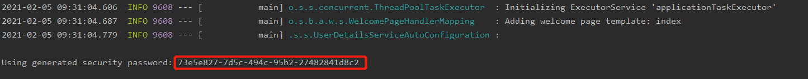

# 项目说明
本项目整合Spring Security安全框架实现对应用系统的安全访问控制。
# security介绍


# 整合过程

## 初步引入security
在未引入spring security 依赖之前，用户不用登录，系统的任何接口可随意访问。启动服务浏览器访问http://localhost:8080，可直接到达
,只要知道接口地址就可以随意访问，这种情况对于系统来说是不安全的，所以需要加入用户登录认证。

（1）引入核心依赖包
```
        <dependency>
            <groupId>org.springframework.boot</groupId>
            <artifactId>spring-boot-starter-security</artifactId>
        </dependency>
```

引入spring security依赖包后，不用做任何配置，启动服务，浏览器访问http://localhost:8080，会发现跳转到默认的登录界面，地址被转发到http://localhost:8080/login
并渲染, 此时的默认用户名为user，密码为平台自动动态生成的一串数字（每重启一次项目则还一个），在项目控制台可见。
在登录页输入用户名与密码后，认证通过，url定向到http://localhost:8080/，页面跳转至template路径下自定义的index文件生成的
## 单用户的用户名和密码
除security可以自动动态生成密码外，还可以通过application.yml配置文件配置固定的单用户的用户名和密码。
```
spring:
  security:
    user:
      name: admin
      password: admin123
```
配置结束后，重新启动服务，浏览器访问http://localhost:8080，跳转到默认的登录界面，输入admin，admin123登录即可。   

## 多用户的用户名和密码
通过SecurityConfig配置类，将多用户的用户名和密码存入内存中，重新启动服务，浏览器访问http://localhost:8080，跳转到默认的登录界面，输入admin/admin，guest/guest登录即可。   
```
@Configuration
@EnableWebSecurity
public class SecurityConfig extends WebSecurityConfigurerAdapter {
    @Override
    protected void configure(AuthenticationManagerBuilder auth) throws Exception {
        //inMemoryAuthentication 从内存中获取
        auth.inMemoryAuthentication().passwordEncoder(new BCryptPasswordEncoder()).withUser("admin").password(new BCryptPasswordEncoder().encode("admin")).roles("");
        auth.inMemoryAuthentication().passwordEncoder(new BCryptPasswordEncoder()).withUser("guest").password(new BCryptPasswordEncoder().encode("guest")).roles("");

    }
}
```

## SpringSecurity+Mysql
以上三个流程仅是对spring security做使用演示，在企业应用项目中一般用户登录的用户名、密码均在数据库中存储，并非以上的硬编码形式。


  
